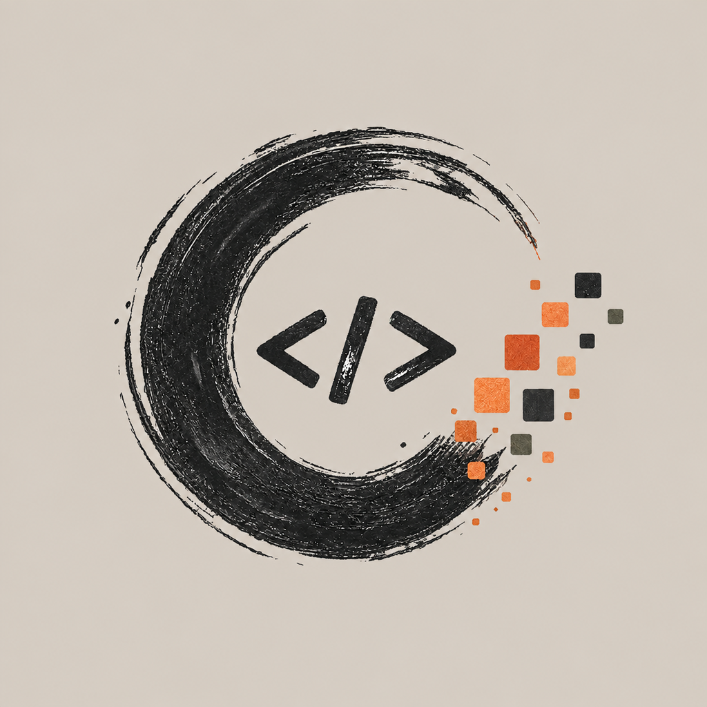
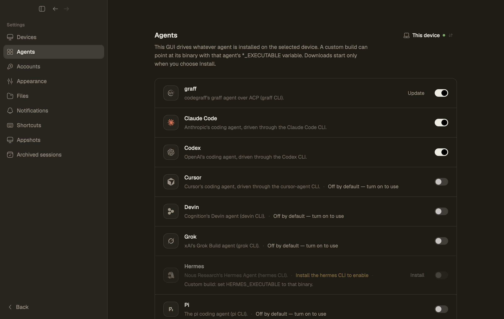
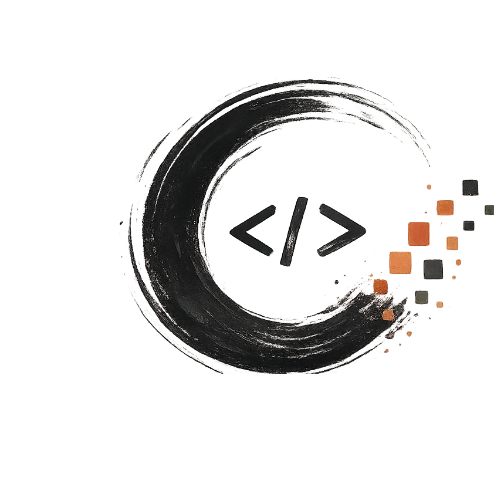
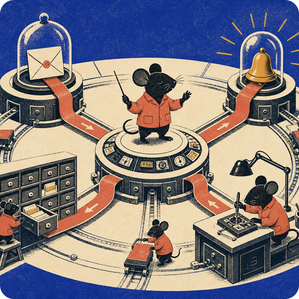

<p align="center"></p>

<h1 align="center">Harness</h1>

<p align="center">आपकी मशीनों पर चलने वाले कोडिंग एजेंटों के लिए एक नेटिव कार्यक्षेत्र।</p>

<p align="center"><a href="README.md">English</a> · <a href="README.zh-CN.md">简体中文</a> · <a href="README.de.md">Deutsch</a> · हिन्दी · <a href="README.thai.md">ไทย</a> · <a href="README.indo.md">Bahasa Indonesia</a> · <a href="README.malay.md">Bahasa Melayu</a></p>

Harness एक डेस्कटॉप इंटरफ़ेस में **CodeGraff (graff)**, Claude Code, Codex,
Cursor, Devin, Grok, Hermes, Pi, OpenCode और Antigravity को साथ लाता है। बिना
बिना खाते के स्थानीय रूप से शुरू करें। जब ज़रूरत हो, तभी भरोसेमंद डिवाइसों पर
सत्र सिंक करें।

## Harness के अंदर

| एजेंट चुनें | graff के साथ काम करें |
| :---: | :---: |
|  |  |

मॉडल चुनें, बातचीत के साथ बदलाव जाँचें और ऐप में ही फ़ाइलें व ब्राउज़र खोलें।
डेस्कटॉप ऐप Rust/GPUI पर बना है; iOS साथी ऐप SwiftUI में सिंक हुए सत्र दिखाता है।

### CodeGraff के साथ

Harness में [CodeGraff](https://github.com/justrach/codegraff) का विशेष एडाप्टर है।
नीचे का प्रतीक और चित्र CodeGraff से हैं; श्रेय [तृतीय-पक्ष सूचनाओं](THIRD_PARTY_NOTICES.md)
में दिया गया है।

<p align="center"> </p>

## स्रोत से चलाएँ

[`rust-toolchain.toml`](rust-toolchain.toml) में दिए गए Rust संस्करण का उपयोग करें।

| प्लेटफ़ॉर्म | कमांड |
| --- | --- |
| macOS | `./scripts/run-macos-dev.sh` |
| Linux | `cargo build -p harness && ./target/debug/harness` |
| Windows | `cargo run --locked -p harness` |

macOS स्क्रिप्ट `target/macos-dev/Harness.app` खोलती है। उदाहरण सत्रों वाला
ऑफ़लाइन डेमो चलाने के लिए `./scripts/dev-demo.sh` उपयोग करें।
[Windows](docs/reference/windows-development.md) और [Linux ब्राउज़र](docs/reference/linux-browser.md)
के निर्देश अलग से उपलब्ध हैं।

## यह कैसे काम करता है

हर डेस्कटॉप अपनी इंजन चलाता है और स्थानीय सत्र वहीं रखता है। `harness` GUI
खोलता है; `harness headless` बिना विंडो के इंजन चलाता है। इंस्टॉल किए गए एजेंट
`PATH` से खोजे जाते हैं। और जानकारी [आर्किटेक्चर](ARCHITECTURE.md) में है।

सिंक वैकल्पिक है। सिंक खाते में जाने से पहले इंजन रोकें:

```sh
harness daemon stop
harness login
harness daemon start
```

एक ही खाते के भरोसेमंद डिवाइस दूसरे डिवाइस की कार्यक्षेत्र फ़ाइलें पढ़ और
बदल सकते हैं। **Show ignored files** चालू करने पर `.env` जैसी अनदेखी फ़ाइलें
भी उपलब्ध हो जाती हैं। पुराने स्थानीय सत्र स्थानीय प्रोफ़ाइल में रहते हैं;
`harness logout` के बाद इंजन दोबारा शुरू करके वहाँ लौटें।

## लाइसेंस

Harness [संशोधित GNU Affero General Public License, संस्करण 3](LICENSE)
(AGPL-3.0 और अतिरिक्त शर्तें) के अंतर्गत उपलब्ध है, जिसकी बनावट
[CodeGraff](https://github.com/justrach/codegraff) के लाइसेंस जैसी है। नेटवर्क पर
उपयोग से धारा 13 लागू होती है। Standard Harness Pte. Ltd., Rach Pradhan
(justrach) और Yu Xi Lim (yxlyx) अपने स्वामित्व वाले मूल Harness योगदान के
प्रोप्राइटरी या होस्टेड संस्करण देने का अधिकार सुरक्षित रखते हैं। प्राप्तकर्ता का
AGPL लाइसेंस तब तक स्थायी है जब तक वह स्वयं उसका उल्लंघन न करे। कॉपीलेफ़्ट के बिना
व्यावसायिक अनुमति तभी मिलती है जब तीनों लिखित रूप से मिलकर दें, और उसे वापस
लिया जा सकता है। अन्य सामग्री की मूल कॉपीराइट और लाइसेंस सूचनाएँ
[तृतीय-पक्ष सूचनाओं](THIRD_PARTY_NOTICES.md) में हैं।

**कंपनियों को व्यावसायिक लाइसेंस चाहिए।** v0.2.108 के बाद के हर संस्करण में एक
अतिरिक्त शर्त है। आपके संगठन को, उन संगठनों के साथ मिलाकर गिनने पर जो उसे नियंत्रित करते हैं, जिन पर
उसका नियंत्रण है, या जो उसके साथ समान नियंत्रण में हैं, Harness के किसी
भी उपयोग के लिए (अपनी मशीनों, क्लाउड, CI और नेटवर्क पर भी) व्यावसायिक लाइसेंस
चाहिए, यदि वह इनमें से **कोई एक** शर्त पूरी करता है:

- उसने निवेशकों या ऋणदाताओं से कुल **US$500k** से अधिक जुटाए हैं;
- उसकी निवल संपत्ति या नवीनतम मूल्यांकन **US$500k** से अधिक है;
- पिछले वित्त वर्ष में या किसी भी 12 महीने की अवधि में उसका सकल राजस्व
  **US$100k** से अधिक रहा है।

कोई सीमा पार करने वाली कंपनी को 5 कार्य दिवसों के भीतर हमसे संपर्क करना होगा।
व्यक्ति अपनी आय चाहे जितनी हो, Harness हमेशा AGPL के अंतर्गत उपयोग करते हैं; वे
संगठन भी, जो इनमें से कोई शर्त पूरी नहीं करते। v0.2.108 तक के संस्करण उसी
लाइसेंस के अंतर्गत रहते हैं जिसके साथ वे जारी हुए थे। संदेह हो तो स्वयं को इसके
दायरे में मानें और [rach@standardharness.com](mailto:rach@standardharness.com) पर संपर्क करें।
