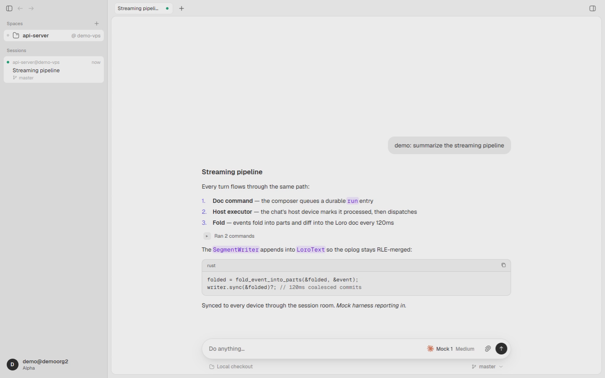

<p align="center">
  
</p>

<h1 align="center">Harness</h1>

<p align="center">
  <strong>One native workspace for your coding agents.</strong><br>
  Work locally, move between machines, and keep the conversation together.
</p>

<p align="center">
  <a href="#the-workspace">See the app</a> ·
  <a href="#get-started">Get started</a> ·
  <a href="#codegraff">CodeGraff</a> ·
  <a href="#license">License</a>
</p>

<p align="center">
  English · <a href="README.zh-CN.md">简体中文</a> ·
  <a href="README.de.md">Deutsch</a> ·
  <a href="README.hindi.md">हिन्दी</a> ·
  <a href="README.thai.md">ไทย</a> ·
  <a href="README.indo.md">Bahasa Indonesia</a> ·
  <a href="README.malay.md">Bahasa Melayu</a>
</p>

<p align="center">
  
  <br><sub>A conversation in Harness, available on another trusted device.</sub>
</p>

## The workspace

Harness brings **CodeGraff (graff)**, Claude Code, Codex, Cursor, Devin, Grok,
Hermes, Pi, OpenCode, and Antigravity into one desktop app. Pick the agent and
model for each conversation, keep workspaces and sessions together, and review
changes beside the chat. Files, a browser, and terminals stay close at hand.

| Choose agents on each device | Follow work across devices |
| :---: | :---: |
|  |  |
| Installed agents appear in **Settings → Agents**. | Sign in when you want another trusted device to follow or control a session. |

Harness starts in local mode without an account. The desktop app uses Rust and
GPUI; its iOS companion is a SwiftUI viewport for synced sessions.

## Get started

Build from a checkout with the Rust version in
[`rust-toolchain.toml`](rust-toolchain.toml):

| Platform | Run |
| --- | --- |
| macOS | `./scripts/run-macos-dev.sh` |
| Linux | `cargo build -p harness && ./target/debug/harness` |
| Windows | `cargo run --locked -p harness` |

The macOS script opens `target/macos-dev/Harness.app`. Development data lives
in `target/macos-dev/data` unless `HARNESS_DEV_DATA_DIR` is set. Quit the app
before rebuilding. For an offline tour with seeded sessions, run
`./scripts/dev-demo.sh`.

Windows portable builds use `harness.exe`; keep `harness-update.json` beside
it for in-app updates. See [Windows development](docs/reference/windows-development.md).
The Linux sidebar browser needs the
[browser runtime](docs/reference/linux-browser.md).

## CodeGraff

Harness includes a first-class adapter for
[CodeGraff](https://github.com/justrach/codegraff). Its app icon was designed
to sit beside the CodeGraff mark. The images below come from CodeGraff and
show the visual language and context workflow behind graff.

<p align="center">
  
  &nbsp;&nbsp;
  
</p>

<p align="center">
  
</p>

The macOS app bundles a managed `graff` CLI. While Harness is open, it checks
the [latest stable CodeGraff release](https://github.com/justrach/codegraff/releases)
shortly after launch and every six hours. It installs a newer version only
after verifying the release archive's SHA-256 checksum. You can also update
graff in **Settings → Agents**. Set `HARNESS_GRAFF_AUTO_UPDATE=0` to disable
background checks; Harness leaves a custom `GRAFF_EXECUTABLE` alone.

The CodeGraff images are credited in
[third-party notices](THIRD_PARTY_NOTICES.md).

## Devices and accounts

Each desktop device runs an engine and stores its local sessions. The GUI
connects to an engine on the local IPC port or starts one in the app process.
`harness headless` runs the engine without a window.

To use device sync, stop the engine before changing profiles:

```sh
harness daemon stop
harness login
harness daemon start
```

Harness sign-in uses CodeGraff OAuth. Coding agents keep their own provider
credentials and transport. A trusted remote device can read and write
workspace files; **Show ignored files** also exposes ignored files such as
`.env`. Sign in only devices you trust with those files. Existing local
sessions remain in the local profile. To return to it, stop the daemon, run
`harness logout`, and restart the daemon.

For the internals, see [architecture](ARCHITECTURE.md). For appearance and
theme import, see [the theme guide](docs/theme-system.md).

## License

Harness is available under the [GNU Affero General Public License, version 3](LICENSE)
(`AGPL-3.0-only`), the same AGPL version used as the public license for
[CodeGraff](https://github.com/justrach/codegraff). Standard Harness Pte. Ltd.
reserves rights in the original Harness contributions it owns. Earlier and
third-party material keeps its own copyright and license notices; see
[third-party notices](THIRD_PARTY_NOTICES.md).
