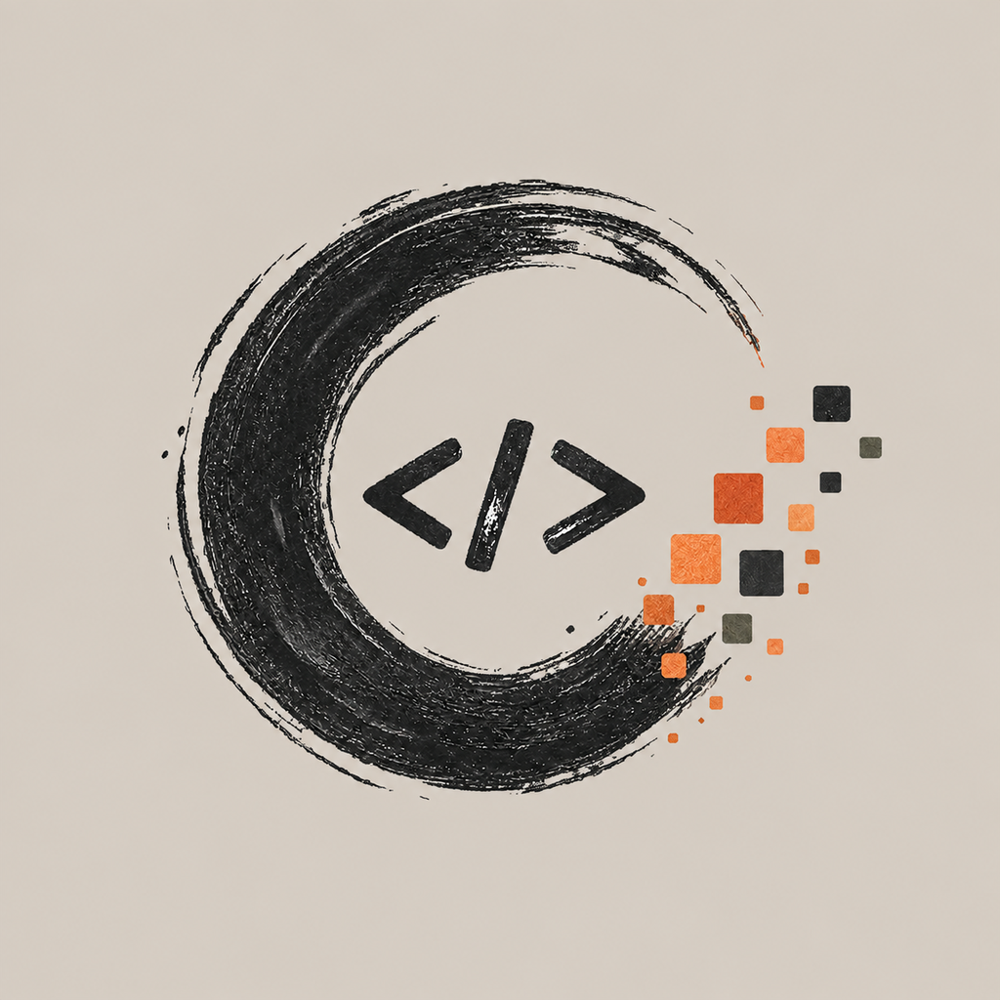
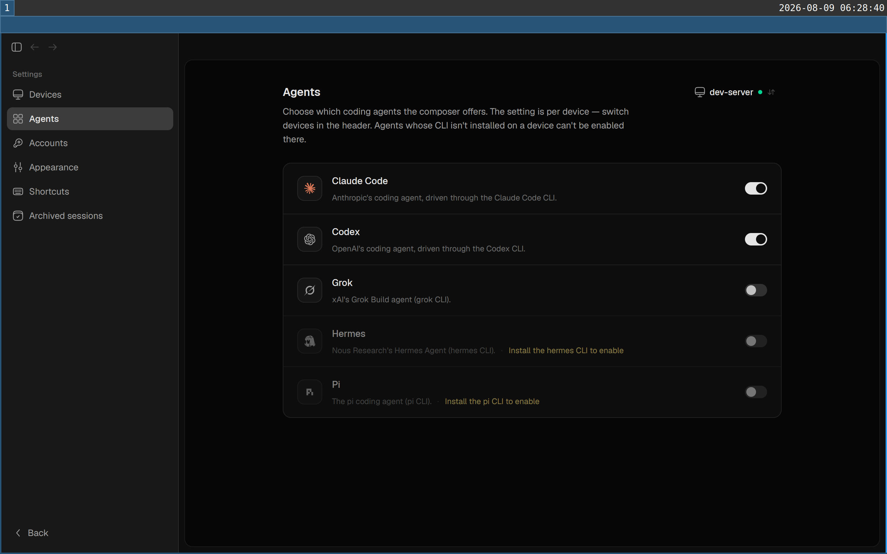
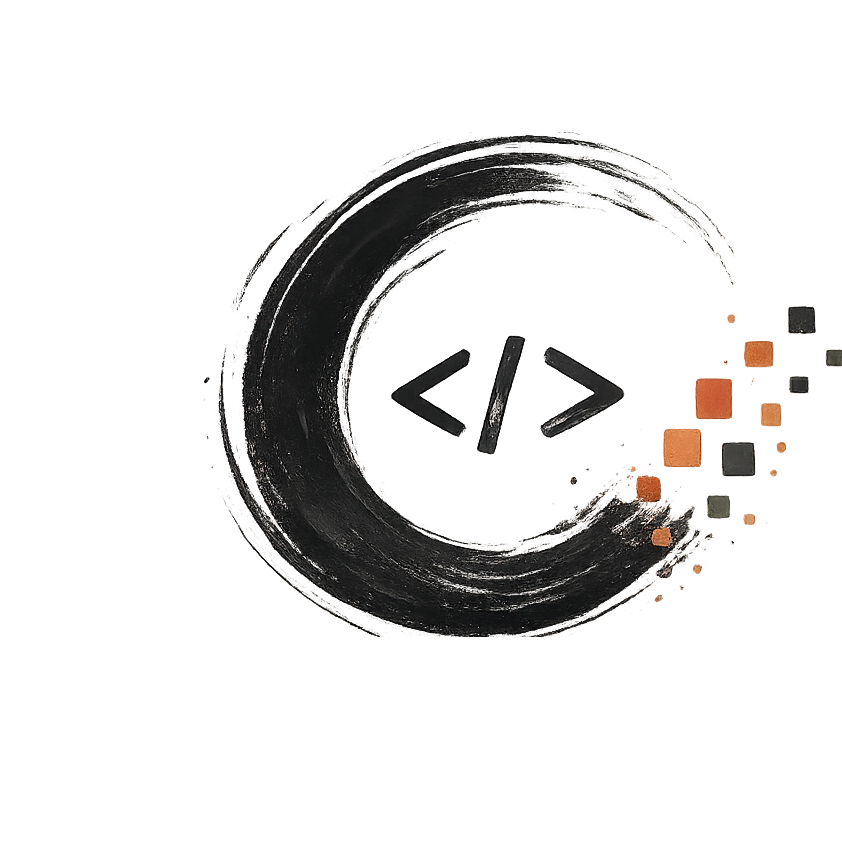

<p align="center"></p>

<h1 align="center">Harness</h1>

<p align="center">พื้นที่ทำงานแบบเนทีฟสำหรับเอเจนต์เขียนโค้ดบนเครื่องของคุณ</p>

<p align="center"><a href="README.md">English</a> · <a href="README.zh-CN.md">简体中文</a> · <a href="README.de.md">Deutsch</a> · <a href="README.hindi.md">हिन्दी</a> · ไทย · <a href="README.indo.md">Bahasa Indonesia</a> · <a href="README.malay.md">Bahasa Melayu</a></p>

Harness รวม **CodeGraff (graff)**, Claude Code, Codex, Cursor, Devin, Grok,
Hermes, Pi, OpenCode และ Antigravity ไว้ในแอปเดสก์ท็อปเดียว เริ่มใช้งานบนเครื่อง
ได้โดยไม่ต้องมีบัญชี แล้วค่อยเปิดการซิงก์เมื่อต้องการติดตามเซสชันจากอุปกรณ์ที่เชื่อถือ

## ภายใน Harness

| เลือกเอเจนต์ | ติดตามเซสชันเดียวกันข้ามอุปกรณ์ |
| :---: | :---: |
|  |  |

เลือกโมเดล ตรวจการเปลี่ยนแปลงข้างบทสนทนา และเปิดไฟล์หรือเบราว์เซอร์ในแอปได้เลย
แอปเดสก์ท็อปใช้ Rust/GPUI ส่วนแอป iOS ใช้ SwiftUI เพื่อดูเซสชันที่ซิงก์

### ทำงานร่วมกับ CodeGraff

Harness มีอะแดปเตอร์สำหรับ [CodeGraff](https://github.com/justrach/codegraff)
โดยเฉพาะ สัญลักษณ์และภาพด้านล่างมาจากโครงการ CodeGraff ดูที่มาและสิทธิ์ได้ใน
[ประกาศซอฟต์แวร์ภายนอก](THIRD_PARTY_NOTICES.md)

<p align="center"> </p>

## เริ่มจากซอร์สโค้ด

ใช้ Rust รุ่นที่ระบุใน [`rust-toolchain.toml`](rust-toolchain.toml)

| ระบบ | คำสั่ง |
| --- | --- |
| macOS | `./scripts/run-macos-dev.sh` |
| Linux | `cargo build -p harness && ./target/debug/harness` |
| Windows | `cargo run --locked -p harness` |

สคริปต์ macOS จะเปิด `target/macos-dev/Harness.app` หากต้องการเดโมแบบออฟไลน์
พร้อมเซสชันตัวอย่าง ให้ใช้ `./scripts/dev-demo.sh` อ่านคำแนะนำสำหรับ
[Windows](docs/reference/windows-development.md) และ [เบราว์เซอร์บน Linux](docs/reference/linux-browser.md)
เพิ่มเติมได้

## วิธีทำงาน

เดสก์ท็อปแต่ละเครื่องมีเอนจินและเก็บเซสชันของตัวเอง `harness` เปิด GUI ส่วน
`harness headless` เปิดเฉพาะเอนจิน แอปค้นหาเอเจนต์ที่ติดตั้งจาก `PATH`
ดูรายละเอียดที่ [สถาปัตยกรรม](ARCHITECTURE.md)

การซิงก์เป็นทางเลือก หยุดเอนจินก่อนเปลี่ยนไปใช้บัญชีที่ซิงก์:

```sh
harness daemon stop
harness login
harness daemon start
```

อุปกรณ์ในบัญชีเดียวกันสามารถอ่านและเขียนไฟล์ในพื้นที่ทำงานของกันและกันได้
เมื่อเปิด **Show ignored files** ไฟล์ที่ถูกละไว้ เช่น `.env` ก็เข้าถึงได้
จึงควรลงชื่อเข้าใช้เฉพาะอุปกรณ์ที่เชื่อถือ เซสชันเดิมยังอยู่ในโปรไฟล์ภายในเครื่อง
กลับไปได้ด้วย `harness logout` แล้วเริ่มเอนจินใหม่

## สัญญาอนุญาต

Harness เผยแพร่ภายใต้ [GNU Affero General Public License รุ่น 3](LICENSE)
(`AGPL-3.0-only`) ซึ่งเป็น AGPL รุ่นเดียวกับสิทธิ์สาธารณะของ CodeGraff
Standard Harness Pte. Ltd. สงวนสิทธิ์เฉพาะผลงาน Harness ที่บริษัทเป็นเจ้าของ
ส่วนผลงานอื่นยังคงประกาศลิขสิทธิ์และสัญญาอนุญาตเดิมไว้ใน
[ประกาศซอฟต์แวร์ภายนอก](THIRD_PARTY_NOTICES.md)
