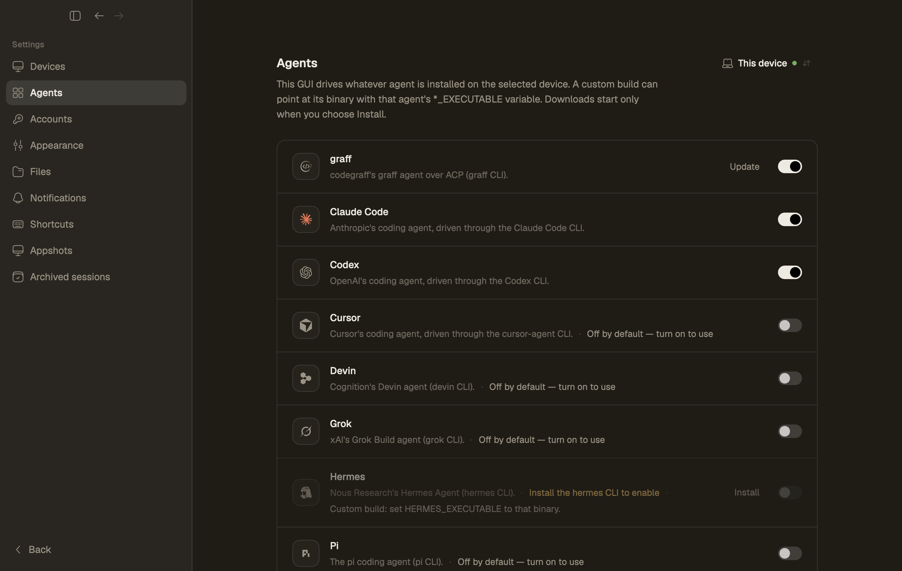
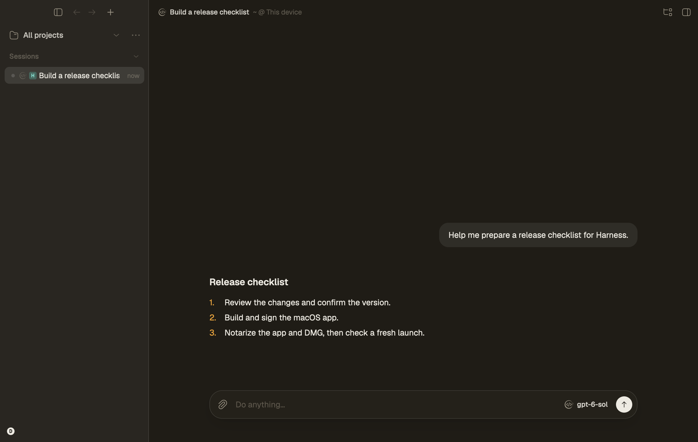

<p align="center"></p>

<h1 align="center">Harness</h1>

在你自己的机器上管理编码 agent 的原生桌面界面：Claude Code、Codex、Cursor、Devin、Grok、Hermes、graff、Pi、OpenCode、Antigravity。默认纯本地，需要时再打开多设备同步。

*[English](README.md) · 简体中文 · [Deutsch](README.de.md) · [हिन्दी](README.hindi.md) · [ไทย](README.thai.md) · [Bahasa Indonesia](README.indo.md) · [Bahasa Melayu](README.malay.md)*

产品名是 **Harness**（`harness.codegraff.app`），命令行程序是 `harness`。同一个程序既能打开图形界面，也能作为无界面引擎运行。

## 看看 Harness

| 选择编码 Agent | 使用 graff 工作 |
| :---: | :---: |
|  |  |

Harness 内置 [CodeGraff](https://github.com/justrach/codegraff) 适配器。下方标志和插画来自 CodeGraff 项目；来源和许可见[第三方声明](THIRD_PARTY_NOTICES.md)。

<p align="center"> </p>

新安装默认使用 **Codegraff** 主题（Warm Graphite：浅色是奶油+琥珀，深色是近黑+金）。设置 → 外观里仍有 Harness、VS Code 目录，以及 VS Code 主题导入。

## 从源码运行

需要 `rust-toolchain.toml` 里的 Rust 工具链（当前是 1.97.1）。

### macOS

```bash
./scripts/run-macos-dev.sh
```

脚本会编译 `harness`，放到 `target/macos-dev/Harness.app`，再通过 Launch Services 打开，这样 TCC 记在应用上而不是终端上。开发数据在 `target/macos-dev/data`（可用 `HARNESS_DEV_DATA_DIR` 覆盖）；IPC 默认端口 `49777`。重建前先退出应用。

离线看效果、带种子会话：

```bash
./scripts/dev-demo.sh
```

### Linux

```bash
cargo build -p harness
./target/debug/harness
```

发行版式的本地安装仍然走守护进程：

```bash
harness status
harness daemon start|stop|restart|status
harness update
```

侧边栏浏览器需要 [Linux browser runtime](docs/reference/linux-browser.md)。

### Windows

解压便携 ZIP，运行 `harness.exe`，把 `harness-update.json` 放在旁边才能应用内更新。源码构建见 [Windows development](docs/reference/windows-development.md)。

```powershell
cargo run --locked -p harness
```

## 它怎么跑

每台设备跑一个小引擎，会话就存在这台设备上。新安装默认纯本地，不用账号，也不用联网。

- **带界面**（`harness`）：打开 GUI。如果守护进程已经在听 IPC 端口，就连上去；否则在进程内跑引擎，并在同一端口上给其他视口提供服务。
- **无界面**（`harness headless`）：只有引擎。VPS 可以在你合上笔记本之后继续跑 agent。
- **Agent** 从 `PATH` 发现（再加上文档里的 `*_EXECUTABLE` 覆盖）。设置 → Agents 会写明。新的 harness 是一个适配器，不是去 fork 这份 GUI。

详见 [ARCHITECTURE.md](ARCHITECTURE.md) 和 [docs/theme-system.md](docs/theme-system.md)。

## 可选：多设备同步

只有想打开账号下的同步工作区时才需要登录。登录会换掉引擎*下次*启动时用的 profile，所以改之前先停掉守护进程：

```bash
harness daemon stop
harness login
harness daemon start
```

之后可以在一台同步过的设备上起 agent，换另一台接着看、接着操作。

登录同一同步账号的设备彼此信任远程工作区访问。一台设备控制另一台设备上的工作区时，可以列出、读取和写入文件；打开 `Show ignored files` 也会让 `.env` 这类被 gitignore 的文件远程可见。`.git` 始终排除。只登录你信任能看到工作区全部内容的设备。

登录不会上传、搬走或导入已有的本地会话。它们留在本地 profile 下，切回纯本地模式时会回来：

```bash
harness daemon stop
harness logout
harness daemon start
```

如果有引擎正占着数据目录，`harness login` 和 `harness logout` 会拒绝改凭据。桌面应用同样遵守这条边界：profile 要等下次重启才切换。

macOS 上用桌面发行包，或者从源码构建 `harness` 再运行 `harness daemon install` 装 launchd 服务。

## 许可

Harness 使用 [GNU Affero General Public License 第 3 版](LICENSE)（`AGPL-3.0-only`），与 CodeGraff 的公共许可采用相同的 AGPL 版本。Standard Harness Pte. Ltd. 保留其拥有的原创 Harness 贡献的权利；已有代码和第三方材料仍保留各自的版权与许可声明，详见[第三方声明](THIRD_PARTY_NOTICES.md)。
