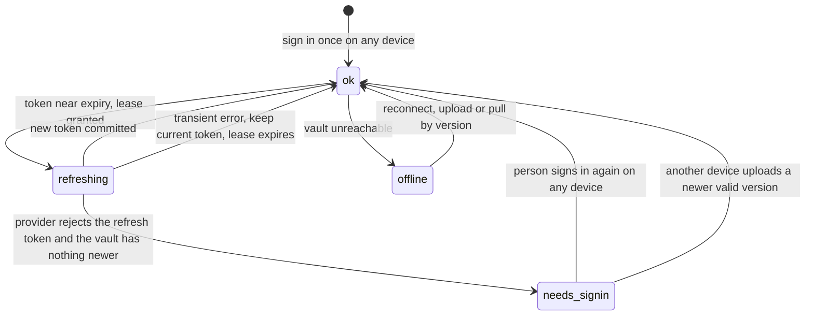

# ADR 0005: Sync agent logins between a person's own devices, end-to-end encrypted, through graff

- Status: Proposed
- Date: 2026-09-26

## Context

graff (codegraff) is the main harness, and Harness is its GUI. Harness also runs any other ACP agent (ADR 0003, ADR 0004), but graff comes first.

Every engine a person runs (the desktop app, `harness headless` on a VPS, later a sandbox) needs its own agent logins. `graff login` covers four subscription providers, one file each:

| Provider | Sign-in | File | Refresh |
| --- | --- | --- | --- |
| Codex (ChatGPT) | PKCE, loopback `localhost:1455` | `$CODEX_HOME/auth.json` | rotating refresh token |
| Kimi Code | device code; moving to a console API key (codegraff #1297) | `~/.kimi/credentials/graff-oauth.json` | rotating today, static after #1297 |
| xAI (SuperGrok) | device code | `~/.xai/credentials/graff-oauth.json` | rotating refresh token |
| Z.AI Coding Plan | CLI broker, then a provisioned key | `~/.zai/credentials/graff-oauth.json` | static key |

Agent accounts (`crates/engine/src/agent_accounts.rs`) already detects each agent's live login, snapshots it into a slot under `{data_dir}/agent-accounts/{harness}/{slotId}.json`, switches slots, and can drive a sign-in on another device for a `requester`. Nothing moves a login from one device to another, so a new VPS means signing in to everything again.

A hosted design, where the service keeps the token and calls the provider on the person's behalf, is ruled out by the providers' terms (read 2026-09-26):

- Z.AI: the plan may not be used "from your own applications, bots, websites, SaaS products or other systems", nor proxied, without a written agreement (`docs.z.ai/legal-agreement/subscription-terms`, §4).
- Kimi Code: "interactive use only"; no reselling as a service; no non-interactive automation; a reverse proxy that shares an account is a violation; client identity must not be altered (`kimi.com/code/docs/en/kimi-code/community-guidelines`).
- OpenAI and xAI consumer terms: do not "share your account credentials or make your account available to anyone else". Both support subscription sign-in inside third-party tools on the subscriber's machine, and xAI documents a headless/VPS variant (`x.ai/news/grok-opencode`).

What is allowed is the subscriber's own agent, on a machine the subscriber runs, making the call. Sync has to keep it that way.

## Decision

1. **Local first.** graff and Harness work fully with no account and no network beyond the model providers. Sync is opt-in, and turning it off leaves every login where it is.

2. **The edge stores logins and never uses them.** No edge code decrypts a credential or calls a provider with one. The vault only carries logins between a person's own engines.

3. **End-to-end encryption.** Each device holds an X25519 key pair (Keychain on macOS, a 0600 file elsewhere). A random 32-byte per-user vault key encrypts each item with XChaCha20-Poly1305, with `userId|agent|slot|version` as associated data. The vault key is stored only wrapped to each enrolled device's public key (ephemeral X25519 + HKDF-SHA256). The first device creates it. A new device posts its public key; an enrolled device approves it and uploads the wrapped key. An optional recovery code, shown once, also wraps it. Losing every device and the code means signing in again.

4. **One Durable Object per user on the edge** (`vault1/{userId}`), authorized by the existing Harness bearer (`edge/src/auth.ts`). It holds device public keys, wrapped vault keys, and per item `{agent, slot, version, kind: rotating|static, status, holder, nonce, ciphertext, updatedAt, updatedBy}`:
   - `GET /vault`: devices and item headers; ciphertext on request
   - `PUT /vault/items/{agent}/{slot}` with `If-Match: <version>` (compare-and-swap)
   - `POST /vault/items/{agent}/{slot}/lease`: a 60 s refresh lease
   - `POST /vault/items/{agent}/{slot}/hold`: take over as the active device for a rotating login
   - `POST /vault/devices`, `POST /vault/devices/{id}/approve`, `DELETE /vault/devices/{id}`

   A write nudges the person's other devices through the DeviceRoom (`edge/src/device-nudges.ts`). The vault is per person. There is no organization vault, because sharing a subscription is exactly what the terms forbid.

5. **graff is the vault client.** The device key, the crypto and the wire format live once, in graff: `graff keys status|push|pull|devices|approve|grant`, and `graff login <provider> --sync`. graff writes the same credential files it already reads, so its runtime path does not change. graff signs in to the edge through the headless CodeGraff sign-in (`/auth/cli/callback`); under Harness, the engine passes its bearer instead. The graff CLI syncs on its own, with no GUI.

6. **Harness is the GUI for it.** The engine calls `graff keys … --json` for Settings → Accounts, device approval and sandbox grants, and never implements the crypto. For other agents, the engine's agent-accounts stores read and write their credential files and pass the bytes through `graff keys put|get <agent>/<slot>`; graff stores them as opaque items. Without graff installed, Harness runs every agent local-only.

7. **Rotating logins never race.** A single-use refresh token can have only one refresher.
   - **graff's own providers refresh under a lease.** Before refreshing a synced login, graff takes the lease; if another device already refreshed, graff pulls that version instead. After refreshing, graff PUTs the next version and releases. This is the cross-device form of graff's in-process single-flight refresh guard, and it lets every engine use the same graff login at once.
   - **Other agents use one holder at a time.** An agent that refreshes inside its own CLI cannot take a lease, so its rotating login is held by one device. Starting a run on another device takes over the hold: the new holder pulls the latest version, and the previous holder stops using that slot until it takes the hold back. Static credentials (API keys) sync freely for any agent.

8. **Enrolled engines get the whole login; sandboxes get access tokens.** Desktops and headless VPS engines enroll as devices. A disposable sandbox never receives the vault key or a refresh token. For graff's providers, `graff keys grant` on an enrolled engine hands the sandbox one provider's current access token at launch and re-grants it before expiry. Other agents get sandbox grants only when their store can inject a short-lived token.

## Login states and failures

Each vault item carries a plaintext `status` next to its ciphertext, so every device can show it without decrypting: `ok`, `refreshing` (a lease is held), or `needs_signin`. A device adds a local `offline` state when it cannot reach the vault.

| Failure | Behavior |
| --- | --- |
| Network error while refreshing | Keep the current token, retry on the next turn. The lease expires after 60 s so another device can try. |
| Two devices want to refresh | Only the lease holder refreshes; the other pulls the committed version. |
| Provider rejects the refresh token (`invalid_grant`, or 401/403 on refresh) | Pull the vault first. If it holds a newer version, use it. Otherwise set `needs_signin`. |
| `needs_signin` | Every device shows it. A run that needs the login fails its turn with a sign-in action, and queued turns wait. Signing in on any one device clears it everywhere. |
| Vault unreachable | Use the local copy and refresh locally. On reconnect, PUT with the version the refresh started from; on a version conflict, pull and discard the local result. A device whose refresh token was already spent by another device gets `invalid_grant` and follows the row above, so the worst case is one extra sign-in. |
| Device removed | Its wrapped key is deleted, so it receives no new versions. It keeps any token it already holds until that token's next rotation on another device; static keys must be re-provisioned to cut it off. |

Signing in again happens on the device the person is using, not the one that failed; the result syncs to the rest. xAI and Kimi use device codes, so Harness shows the verification URL and code in the app and the person approves in any browser, including on a phone. Codex needs its loopback callback, so it runs on the device with the browser, or through the existing `requester` forwarding.

## What graff priority means

- graff's four provider logins ship first and sync by default once sync is on, with Z.AI off until graff is confirmed as a supported Coding Plan tool (the terms limit the plan to listed tools on any machine).
- Only graff's providers get concurrent use across devices (the lease), sandbox grants, and sync state in graff's model picker. Other agents get the hold model.
- Claude Code, Codex, Cursor, Grok, Devin, OpenCode, Pi, Hermes and Antigravity stay local-only until each provider's terms are checked and its store is marked syncable.

## Consequences

- A compromised edge exposes ciphertext, public keys and item status, not logins.
- Model traffic still leaves from the person's own engines. That matches the supported pattern for xAI and OpenAI, and for Kimi while a person drives the session. Unattended Kimi runs in sandboxes are opt-in, because Kimi fingerprints devices and restricts non-interactive use.
- One implementation of the crypto and wire format, in graff. Harness sync depends on graff being installed.
- Order: (1) vault Durable Object and `graff keys` with leases; (2) the Accounts UI and device approval in Harness; (3) the hold model and other agents' stores; (4) sandbox grants.

## Evidence

- `crates/engine/src/agent_accounts.rs`, `crates/engine/src/agent_accounts/stores.rs`: slot snapshots, switching, `requester` sign-ins.
- `crates/harness/src/acp/mod.rs`: graff launched as `graff acp`.
- `edge/src/auth.ts`, `edge/src/codegraff.ts`, `edge/src/device-nudges.ts`: the Harness bearer, the headless CodeGraff sign-in, and device nudges.
- codegraff `src/oauth.zig`, `src/oauth_zai.zig`, `src/credential_store.zig`: graff's sign-in flows, file layout and refresh guard.
